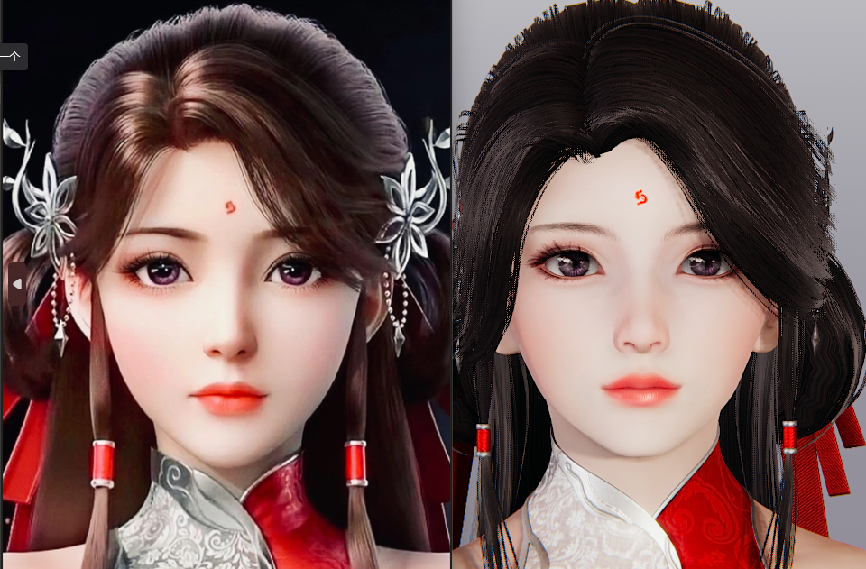
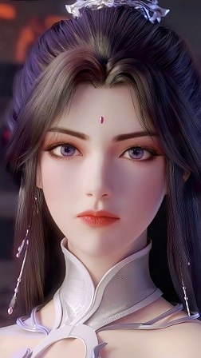
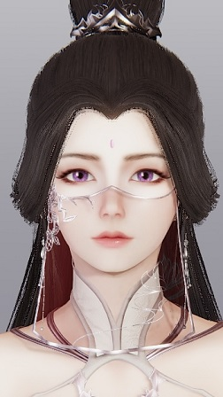

# 介绍
Facial Data Extractor
本软件旨在利用AI从人物图像中提取人脸数据，用于辅助Illusion系列游戏中的人物捏脸。
目前，只支持 AI Shoujo 和 Honey Select2。
如果你想知道使用了什么技术路线，[请看这里](https://github.com/ChasonJiang/Face2Parameter)

# 使用教程:
- Step1. 点击“打开图片”按钮, 选择图片，可选择多张。
- Step2. [可选] 点击“选择人物卡模板”按钮, 选择人物卡模板；若不选择，则使用默认人物卡模板。提取的面部数据将直接作用于人物卡模板。
- Step3. 点击“提取”按钮, 等待提取面部数据。
- Step4. 在游戏中打开生成的*_character.png人物卡；

# 注意事项：
1. 脸型可以使用官方的三种脸型，“类型1、类型2、类型3”，其他脸型请自测。
2. 现在阶段仅支持女性角色，男性角色自测。
3. 现阶段AI并不能完美“复刻”人脸，仍需部分微调。

# 展示

Face data

{
    "全脸宽度": 33,
    "脸上部前后位置": 28,
    "脸部上方和下方": 31,
    "下脸前后位置": 36,
    "脸下部宽度": 28,
    "下颚宽度": 25,
    "下巴上下位置1": 22,
    "下巴前后位置": 51,
    "下颚角度": 34,
    "下颚底部上下位置": 92,
    "下巴宽度": 33,
    "下巴上下位置2": 37,
    "下巴前后": 36,
    "脸颊下部上下位置": 52,
    "下颊前后": 38,
    "下颊宽度": 34,
    "脸颊上部上下位置": 44,
    "上颊前后": 47,
    "脸上部宽度": 46,
    "眼睛上下": 53,
    "眼位": 30,
    "眼睛前后": 25,
    "眼宽1": 45,
    "眼宽2": 33,
    "眼角z轴": 46,
    "眼角y轴": 59,
    "左右眼位置1": 45,
    "左右眼位置2": 47,
    "眼角上下位置1": 59,
    "眼角上下位置2": 39,
    "眼皮形状1": 58,
    "眼皮形状2": 39,
    "整个鼻子上下位置": 31,
    "整个鼻子前后": 37,
    "鼻子整体角度X轴": 43,
    "鼻子的整个宽度": 43,
    "鼻梁高度": 27,
    "鼻梁宽度": 39,
    "鼻梁形状": 50,
    "鼻宽": 40,
    "上下鼻子": 44,
    "鼻子前后": 50,
    "机头角度X轴": 56,
    "机头角度Z轴": 37,
    "鼻子高度": 48,
    "鼻尖X轴": 54,
    "鼻尖大小": 39,
    "嘴上下": 61,
    "口宽": 36,
    "嘴唇宽度": 33,
    "嘴前后位置": 31,
    "上嘴唇形": 38,
    "下嘴唇形": 60,
    "嘴型嘴角": 38,
    "耳长": 47,
    "耳角Y轴": 49,
    "耳角Z轴": 49,
    "上耳形": 51,
    "耳下部形状": 37
}

- Image
  

- in game
  

Face data

{
    "全脸宽度": 20,
    "脸上部前后位置": 35,
    "脸部上方和下方": 41,
    "下脸前后位置": 39,
    "脸下部宽度": 26,
    "下颚宽度": 21,
    "下巴上下位置1": 27,
    "下巴前后位置": 36,
    "下颚角度": 32,
    "下颚底部上下位置": 84,
    "下巴宽度": 41,
    "下巴上下位置2": 33,
    "下巴前后": 32,
    "脸颊下部上下位置": 53,
    "下颊前后": 33,
    "下颊宽度": 30,
    "脸颊上部上下位置": 52,
    "上颊前后": 52,
    "脸上部宽度": 35,
    "眼睛上下": 44,
    "眼位": 32,
    "眼睛前后": 25,
    "眼宽1": 44,
    "眼宽2": 31,
    "眼角z轴": 40,
    "视角y轴": 51,
    "左右眼位置1": 47,
    "左右眼位置2": 49,
    "眼角上下位置1": 54,
    "眼角上下位置2": 41,
    "眼皮形状1": 42,
    "眼皮形状2": 40,
    "整个鼻子上下位置": 40,
    "整个鼻子前后": 53,
    "鼻子整体角度X轴": 38,
    "鼻子的整个宽度": 46,
    "鼻梁高度": 32,
    "鼻梁宽度": 34,
    "鼻梁形状": 54,
    "鼻宽": 46,
    "上下鼻子": 45,
    "鼻子前后": 49,
    "机头角度X轴": 54,
    "机头角度Z轴": 45,
    "鼻子高度": 49,
    "鼻尖X轴": 44,
    "鼻尖大小": 35,
    "嘴上下": 65,
    "口宽": 44,
    "嘴唇宽度": 48,
    "嘴前后位置": 33,
    "上嘴唇形": 29,
    "下嘴唇形": 65,
    "嘴型嘴角": 37,
    "耳长": 39,
    "耳角Y轴": 59,
    "耳角Z轴": 53,
    "上耳形": 50,
    "耳下部形状": 45,
    "眉色": [
        27,
        30,
        22,
        80
    ],
    "唇色": [
        140,
        68,
        88,
        65
    ],
    "眼影颜色": [
        90,
        52,
        46,
        58
    ],
    "腮红颜色": [
        160,
        125,
        110,
        26
    ]
}

- Image
  

- in game
  

Face data

{
    "全脸宽度": 34,
    "脸上部前后位置": 22,
    "脸部上方和下方": 36,
    "下脸前后位置": 37,
    "脸下部宽度": 25,
    "下颚宽度": 25,
    "下巴上下位置1": 21,
    "下巴前后位置": 38,
    "下颚角度": 36,
    "下颚底部上下位置": 73,
    "下巴宽度": 24,
    "下巴上下位置2": 33,
    "下巴前后": 30,
    "脸颊下部上下位置": 50,
    "下颊前后": 28,
    "下颊宽度": 33,
    "脸颊上部上下位置": 40,
    "上颊前后": 45,
    "脸上部宽度": 38,
    "眼睛上下": 46,
    "眼位": 24,
    "眼睛前后": 17,
    "眼宽1": 37,
    "眼宽2": 35,
    "眼角z轴": 38,
    "视角y轴": 45,
    "左右眼位置1": 39,
    "左右眼位置2": 36,
    "眼角上下位置1": 54,
    "眼角上下位置2": 30,
    "眼皮形状1": 45,
    "眼皮形状2": 36,
    "整个鼻子上下位置": 33,
    "整个鼻子前后": 43,
    "鼻子整体角度X轴": 31,
    "鼻子的整个宽度": 38,
    "鼻梁高度": 25,
    "鼻梁宽度": 29,
    "鼻梁形状": 42,
    "鼻宽": 40,
    "上下鼻子": 39,
    "鼻子前后": 41,
    "机头角度X轴": 49,
    "机头角度Z轴": 34,
    "鼻子高度": 38,
    "鼻尖X轴": 40,
    "鼻尖大小": 27,
    "嘴上下": 60,
    "口宽": 33,
    "嘴唇宽度": 31,
    "嘴前后位置": 24,
    "上嘴唇形": 33,
    "下嘴唇形": 44,
    "嘴型嘴角": 38,
    "耳长": 37,
    "耳角Y轴": 47,
    "耳角Z轴": 44,
    "上耳形": 46,
    "耳下部形状": 37,
    "眉色": [
        46,
        52,
        34,
        81
    ],
    "唇色": [
        143,
        65,
        72,
        54
    ],
    "眼影颜色": [
        87,
        53,
        54,
        47
    ],
    "腮红颜色": [
        145,
        92,
        84,
        26
    ]
}

